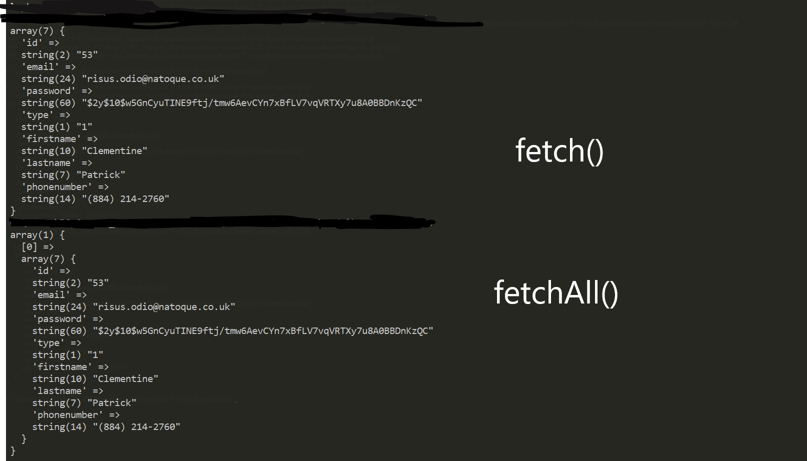

# Mémento en PHP et BDD en ICT-151:
## Intégrer des BDD dans des applications WEB

### Introduction:
Dans ce cours, on travaille avec **PDO** (PHP Data Objects). C'est un outil pour travailler avec les bases de données. (comme pour la pelle qui est un outil pour creuser, il y a plusieurs outils pour travailler avec des bases de données, mais nous n'utiliserons dans ce cours que PDO).

Pour ce mémento, on utilise une base de donnée appelée `mcu` qui contient des données sur des films marvel. On retrouve [le script SQL ici](../Restore-MCU-PO-Final.sql).

### CRUD
C'est l'acronyme des 4 fonctionnalités générales qu'on retrouve dans beaucoup d'applications en informatiques, puisque c'est les seuls possibilités d'intéragir avec des données.
- **C**reate: créer
- **R**ead: lire
- **U**pdate: mettre à jour/modifier
- **D**elete: supprimer

### Notions de bases
Exemple de première utilisation (code repris de php.net et valeurs adaptées):

    //Identifiants pour la DBB
    $user = "ICT-151";
    $pass = "Pa\$\$w0rd";

    try {
        $dbh = new PDO('mysql:host=localhost;dbname=mcu', $user, $pass);
        foreach ($dbh->query('SELECT * from actors') as $row) {
            var_dump($row);
        }
        $dbh = null;
    } catch (PDOException $e) {
        print "Error!: " . $e->getMessage() . " ";
        die();
    }

Avec CMDER ou tout autre shell:

    C:\Users\john\Documents\Github\ICT-151-Sandbox (master -> origin)  //on vient sur DOCUMENTROOT du serveur.
    λ php -f index.php  //fichier php à exécuter
    Array
    (
        [id] => 1
        [0] => 1
        [actornumber] => 1
        [1] => 1
        [lastname] => Ruffalo
        [2] => Ruffalo
        [firstname] => Mark
        [3] => Mark
        [birthdate] => 1967-11-22
        [4] => 1967-11-22
        [nationality] => USA
        [5] => USA
    )
    Array
    (
        [id] => 2
        [0] => 2
        [actornumber] => 2
        [1] => 2
        [lastname] => Holland
        [2] => Holland
        [firstname] => Tom
        [3] => Tom
        [birthdate] => 1996-06-01
        [4] => 1996-06-01
        [nationality] => UK
        [5] => UK
    )

Résultat: Il exécute le fichier php et affiche donc les deux enregistrements trouvés dans la BDD.

Mais c'est un gros problème d'**avoir les identifiants en clair dans le code** et de les publier sur Github ! Pas très pratique aussi, si on doit changer les identifiants dans plein de fichiers différent, quand ils changent.
C'est pour cette raison qu'on va **faire un fichier séparé `.const.php`** qui contient les constantes pour la connexion à la BDD, mais on peut aussi y stocker d'autres données qui doivent rester en local ou qui serve au développement. Le fichier commence par un `.`. C'est une convention pour les fichiers cachés.

    <?php
    /**
    *  Projet: ICT-151-Sandbox
    *  Filename: Identifiants de login
    *  Author: Samuel Roland
    *  Creation date: 07.02.2020
    */

    $user = "ICT-151";
    $pass = "Pa\$\$w0rd";
    $dbhost = "localhost";
    $dbname = "mcu";
    ?>

Ensuite:
- on ignore le fichier en l'ajoutant au `.gitignore` pour ne pas l'envoyer sur Git.
- on le récupère le contenu du fichier par un `require .const.php;` en haut de la fonction. Attention à ne pas utiliser `require_once` puisque plusieurs fonctions vont en avoir besoin.

Le problème qui arrive maintenant est que les développeurs qui travaillent avec nous ne savent pas qu'on a fait ce fichier séparé puisque ce fichier n'est pas envoyé sur Github. (sauf si il lise le `require .const.php;` mais ils ne savent pas ce qu'il y a dedans précisément). Pour résoudre ce problème, on fait une copie du fichier nommée `.const.php.example` avec les variables mais sans valeurs. Ils pourront ensuite dupliquer le fichier et le renommer, et remplir les valeurs pour arriver au même point que nous. Le `*.example` à la fin du nom du fichier est souvent utilisé dans le développement et donc facilement compréhensibles par d'autres développeurs.

Exemple de contenu du fichier:

    <?php
    /**
    *  Projet: ICT-151-Sandbox
    *  Filename: Identifiants de login
    *  Author: Samuel Roland
    *  Creation date: 07.02.2020
    */
    
    //TODO: renommer le fichier en .const.php et remplir les valeurs pour la database
    $user = "";
    $pass = "";
    $dbhost = "";
    $dbname = "";
    ?>

Pour faire une requête il y a 4 étapes:

On crée un objet PDO de cette manière:

    $dbh = new PDO('mysql:host=' . $dbhost . ';dbname=' . $dbname, $user, $pass);

1. La requête SQL dans une string:

        $query = "SELECT id, lastname, firstname FROM filmmakers"; 
    

2. Préparer la requête = envoyer au serveur web (vérification de type sécuritaire):

        $statment = $dbh->prepare($query);

3. On peut éxecuter la requête:
    
        $statment->execute();

4. Aller chercher tous les résultats:
    
        $queryResult = $statment->fetchAll();
        
5. Ou un seul résultat:

    $queryResult = $statment->fetch();

`fetchAll()` retourne un tableau de tableaux associatifs. tandis que `fetch()` retourne un tableau associatif qui ne contient donc qu'un seul enregistrement.

Visuellement ca donne ca si on teste `fetch()` et `fetchAll()` pour un seul enregistrement. Ca ne fait pas beaucoup de sens d'utiliser fetchAll() puisqu'il faudra utiliser 2 dimensions au lieu d'une seule.

Un `fetch()` sur plusieurs enregistrements prendra uniquement le premier enregistrement...

**ATTENTION particularité**.
Pour ne pas avoir un tableau indexé et associatif (créé par `fetch()` ou `fetchAll()`) en même temps (toutes les données étant donc à double), il faut mettre un paramètre aux méthodes qui dit le type de tableau qu'il doit retourner. Ces paramètres sont des constantes internes de PDO. On les atteind de la manière suivante `PDO::NomConstante`

Une petite liste de possibilités très utiles:
- `PDO::FETCH_ASSOC` pour avoir un tableau associatif uniquement
- `PDO::FETCH_NUM` pour avoir un tableau indexé uniquement (partant de index 0)

Changement:
    
    $queryResult = $statment->fetchAll();
en
    
    $queryResult = $statment->fetchAll(PDO::FETCH_ASSOC);

source: https://www.php.net/manual/en/pdostatement.fetch

### Les paramètres SQL
Afin de se simplifier la vie mais aussi pour sécuriser l'application contre les injections SQL, on utilise des paramètres SQL. Ces paramètres seront remplacés par leurs valeurs durant l'éxecution de la méthode `execute()`. Explication détaillée.

Au lieu de faire comme nous l'avons vu jusqu'à maintenant:
    
    function getOneUser($email)
    {
        try {
            $dbh = getPDO();
            $query = "SELECT * FROM users where users.email =$email";
            $statment = $dbh->prepare($query);
            $statment->execute();
            $queryResult = $statment->fetch(PDO::FETCH_ASSOC);
            $dbh = null;
            return $queryResult;
        } catch (PDOException $e) {
            echo "Error!: " . $e->getMessage() . "\n";
            return null;
        }
    }

On va changer le `$email` en un paramètre appelé `email`. On va mettre un `:` avant pour signifier que c'est un paramètre SQL. (un peu comme le `$` signifie que c'est une variable). Puis dans le paramètre de `$statment->execute()` on va mettre un tableau associatif dont une des clés s'appelle `email`.

    function getOneUser($email)
    {
        try {
            $dbh = getPDO();
            $query = "SELECT * FROM users where users.email =:email";
            $statment = $dbh->prepare($query);
            $statment->execute(["email" => $email]);
            $queryResult = $statment->fetch(PDO::FETCH_ASSOC);
            $dbh = null;
            return $queryResult;
        } catch (PDOException $e) {
            echo "Error!: " . $e->getMessage() . "\n";
            return null;
        }
    }
    
Pour que le remplacement des paramètres par leur données fonctionne, il faut que le paramètre ait le même nom qu'une des clés du tableau associatif fourni comme paramètre (php) de execute(), et aussi que la clé existe dans le tableau (forcément). 

En cas d'erreur (clés inexistantes ou pas toutes les clés):
`PHP Warning:  PDOStatement::execute(): SQLSTATE[HY093]: Invalid parameter number: parameter was not defined in C:\...` et la requête échoue.

**Attention**, les paramètres SQL ne peuvent être utilisé **que pour des valeurs dans la requête** et **non** sur des **noms de tables** ou des **noms de colonnes**.

La requête suivante ne fonctionnera pas:

        $query = "SELECT * FROM :tablename";

Source: [Stackoverflow](https://stackoverflow.com/questions/182287/can-php-pdo-statements-accept-the-table-or-column-name-as-parameter)

### Faire des tests unitaires:

Les tests unitaires permettent de tester le bon fonctionnement de chaque fonction séparément (unitaire = on teste qu'**une seule** fonction). Dans ce cours, on fait des tests unitaires **des fonctions du modèle** et on lance les tests **depuis un shell** donc sans passer par un navigateur car pas besoin de mode graphique.

**IMPORTANT**: Pour faire des tests unitaires, on a besoin de données dont on est le seul à modifier, et surtout on a besoin de pouvoir "connaître" les données. En effet, si on veut tester une fonction qui récupère un utilisateur, comment vérifier les différentes informations si on les connait pas ? On a besoin d'accéder à la base de données avec un client SQL (ou par un autre moyen) et pouvoir constater que l'utilisateur `2355` a les mêmes informations que ce que nous donne le résultat de notre fonction, par exemple.

Une fois qu'on a une fonction (changée le code précédent dans une fonction):

    function getAllItems()  //prendre tous les éléments
    {
        require_once '.const.php';
        try {
            $dbh = new PDO('mysql:host=' . $dbhost . ';dbname=' . $dbname, $user, $pass);
            $query = "SELECT filmmakersnumber, lastname, firstname FROM filmmakers";    //écrire la requête
            $statment = $dbh->prepare($query);  //préparer la requête
            $statment->execute();   //éxecuter la requête
            $queryResult = $statment->fetchAll();   //aller chercher le résultat
            $dbh = null;
            return $queryResult;
        } catch (PDOException $e) {
            print "Error!: " . $e->getMessage() . " ";
            return null;
        }
    }

on peut faire un test unitaire simple:

    //Test unitaire de la fonction getAllItems:
    $items = getAllItems();
    if (count($items) == 4) {
        echo "OK !!";
    } else {
        echo "BUG ...";
    }

### Comment construire des tests unitaires ?
Voici des explications d'une proposition de structure et de critères pour des tests basiques, pour des fonctions CRUD:

#### Idée de structure d'un test:
- un titre "Test de la fonction getUsers()"
- Préparer des données si besoin.
- Utiliser la fonction qu'on va tester, pour faire une action de CRUD
- Tester si le résultat est celui souhaité en vérifiant certains critères
- Affichage d'une erreur ou que le test a réussi.

#### Idées de vérifications pour les tests:
On préférera faire les tests dans l'ordre suivant: Read, Create, Update, Delete, ce qui permet de lire des données, créer un nouvel élément, le modifier, puis le supprimer. 
Ainsi à la fin des tests, le contenu de la base de données n'aura pas été modifié.

Pour simplifier, et ne pas constamment parler d'éléments, on va tester ici un modèle CRUD sur des filmmakers. Ces fonctions et tests ont été réalisés et on les trouve dans le repos ([le modèle crud.php](../crud.php), [le test unitaire testcrud.php](../testcrud.php))

**Read**
- Fonction: **Compter tous les filmmakers**
    - tester que le comptage vaut bien le nombre total de filmmakers. (total = valeur brute/fixe)
- Fonction: **Lire tous les filmmakers**:
    - tester si il y a bien le même nombre de filmmakers que donne le count()
- Fonction:  **Lire un filmmaker** (par un identifiant: id ou champ unique)
    - Tester que tout le filmmaker lu a des champs qui ont les valeurs attendues.
    - Tester que la fonction retourne null si on demande un élément qui n'existe pas.

**Create**
- Fonction: **Créer un filmmaker**
    - Vérifier que la fonction retourne bien le filmmaker créé (avec son id en plus). donc que ce n'est pas null
    - Vérifier qu'il y a un élément de plus que avant la création. (ne pas oublier de compter le nombre avant de créer).
    - Vérifier que le nouveau filmmaker (lu avec "Lire un élément" appelé `$readback`) a les même valeurs que celui créé (`$filmMakerTest` donc celui que l'on a écrit à la main avant de lancer la création) ou que celui retourné (`$newfilmmaker`). Au lieu de tester toutes les informations l'une après l'autre, il suffit de faire `empty(array_diff($newfilmmaker, $readback))` qui devra retourner `true` si il n'y a pas de différence.

**Update**
- Fonction: **Mettre à jour un filmmaker**
    - Regarder que la requête fonctionne
    - Après la mise à jour de champs d'un filmmaker, relire le bon filmmaker et vérifier que tous les champs modifiés ont été mise à jour. On peut le faire aussi en vérifiant qu'il n'y a pas de différence entre le filmmaker lu et le filmmaker qu'on a mis à jour (`empty(array_diff($readback, $filmmakertoupdate))`)
    
**Delete**
- Fonction: **Supprimer un filmmaker**
    - Regarder que la requête fonctionne (arrive bien au bout)
    - Regarder qu'il y a un filmmaker de moins qu'avant la suppression. (en comptant avant et après)
    - Tenter de relire le filmmaker supprimé. Si on le trouve c'est qu'il n'a pas été supprimé.

Ces différentes vérifications, sont données comme exemple pour un CRUD basique. Dans un CRUD plus complet on aura aussi par exemple **Lire tous les films qu'un réalisateur donné a réalisé**. On aura donc d'autres vérifications en plus: vérifier que tous les films ont bien été fait par le réalisateur donné, ... 
Les vérifications proposées sont pour la base, mais sur des fonctions plus complexes on pourra vérifier d'autres critères en plus.

### Executer du php dans un shell ?
Oui cest possible ! Enfin disons que le résultat généré est affiché en mode console. Donc pas vraiment fait pour une vue. Par contre pour des tests, la gestion du serveur ou de la base de donnée, c'est pratique.

#### Démarrer un serveur php si l'application php.exe est installée (avec Choco, npm, ...)
Pour ne pas utiliser d'IDE, on peut lancer le serveur de la manière suivante. 

La commande est construite ainsi: `php -S hote:port`. pour `-S` pensez à "**S**tart". Voyons voir en pratique ce que ca donne.

1. se placer à la racine du site `cd C:/Users/John/Documents/AppWeb/`
1. taper `php -S localhost:8080`. le serveur démarre et affiche les erreurs en cas de problèmes.
1. ouvrir un navigateur web à l'adresse: `localhost:8080` et on accède au site !

#### Executer un fichier php (ici un test unitaire)
1. se placer à la racine du site `cd C:/Users/John/Documents/AppWeb/`
1. savoir dans quel sous dossier se trouve le fichier de test qu'on veut lancer.
1. lancer le fichier avec la commande `php -f <testfile.php>` ou `php -f <unitTests/testfile.php>` si il est placé dans un sous-dossier.

**ATTENTION**.
Si il y a des chemins de fichiers dans le code (pour rechercher des données d'un fichier .json par ex.), les liens relatifs par rapport à la racine du site pourrait poser problème si on execute depuis le dossier `unitTests` puisque les liens seront relatifs au dossier du shell.
Pour ne pas devoir changer 2 fois tous les liens relatifs, il est possible et conseillé de lancer les tests depuis le dossier du fichier `index.php` (donc la racine du site) ou du fichier qui est appelé en premier et donc d'où les liens relatifs partent. Par la suite, il suffit de pointer le fichier de test d'un sous-dossier, par exemple `php -f unitTests/testfile.php`

#### Commandes système 
Alors ce n'est pas directement dans un shell, mais comme ca concerne les commandes système on est pas très loin.

la fonction `exec($cmd)` permet de lancer une commande système stockée dans `$cmd`.

Un cas concret d'utilisation serait de restaurer la base de données avant de lancer tous les tests unitaires, à l'aide d'un fichier SQL.

    $cmd = "mysql -u $user -p$pass < Restore-MCU-PO-Final.sql";   //commande système pour restaurer la base de données.
    exec($cmd);

### TDD = Test Driven Developpement

Littéralement: Developpement conduit/dirigé/guidé par des tests.

Principe de développement où on commence par faire les tests puis on fait le code de ce qui est testé (une fonction par exemple), et on code jusqu'à que le test fonctionne. Le développement est donc guidé par des tests.

### Refactorisation et DRY
Ce qu'on fait là avec ces fonctions du modèle est en fait très répétitif! On ne change que la requête, les données en paramètres de la fonction, les données du execute() et changer en `fetch()` ou `fetchAll()` et ce que la fonction retourne. On ne respecte donc pas du tout la règle **DRY (Don't Repeat Yourself)**.

On a donc les éléments suivants qui sont fixes:
1. `require_once '.const.php';` + `$dbh = new PDO('mysql:host=' . $dbhost . ';dbname=' . $dbname, $user, $pass);`. On le remplace par :

        function getPDO()   //create the PDO object
        {
            require '.const.php';  //récuperer les identifiants
            return new PDO('mysql:host=' . $dbhost . ';dbname=' . $dbname, $user, $pass);   //créer un objet PDO
        }

2. le ` $statment = $dbh->prepare($query);`

3. le `$statment->execute();` qui ne bouge pas peu importe si il y a des données ou pas en paramètre.

4. le `$dbh = null;` 

5. le `try` et le contenu du `catch ...`
    
        try {
        
        } catch (PDOException $e) {
            echo "Error!: " . $e->getMessage() . "\n";
            return null;
        }

Bon maintenant qu'on voit une bonne partie est fixe, on arrive sur la question de "Comment faire pour gérer les différents cas de `fetch()`, `fetchAll()`, données ou pas, return ou pas, etc."

Voici comment on peut faire, même si on ne peut pas faire qu'une seule fonction.

$query = "UPDATE filmmakers SET
		filmmakers:
"