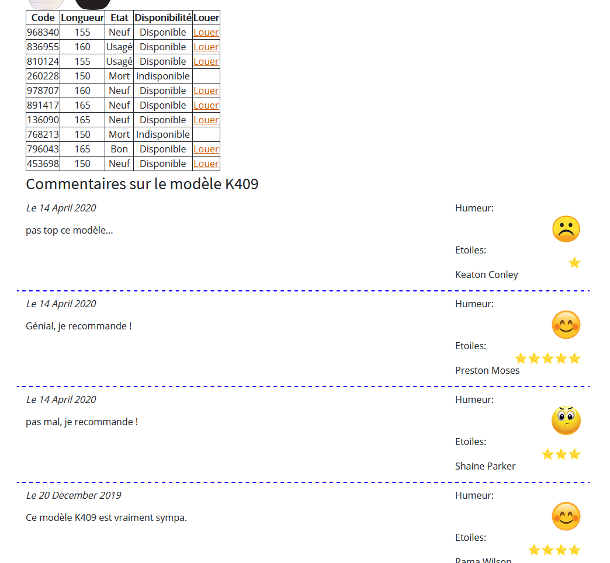

## Examen formatif pour le cours ICT-151
#### 2ème année T7 d'informatique CFC. (réalisé en juin 2020).
Durée 2h15. (temps très large).

## Contexte
L'examen formatif consiste à faire une nouvelle fonctionnalité sur [l'application RentASnow](https://github.com/CPNV-INFO/ICT-151-Rent-a-snow) réalisé en ICT-151 et ICT-133. Vous pouvez reprendre votre propre repos RentAsnow mais il est conseillé de choisir le repository d'une autre personne pour plus de challenge. Les exports et exemples ont été fait sur la base de [ce repos](https://github.com/cpnvbenoit/ICT-151-RentASnow).

### But
L'objectif est d'afficher les commentaires des utilisateurs sur des snowtypes.
Pour ceci, un MLD mis à jour vous est fourni (`MLD_snows-updated.png`) et un script SQL pour mettre à jour la base de donnée (voir plus bas).

### Installation
L'installation de RentASnow est peut-être déjà faite si c'est votre repos, ou alors dépend de ce qu'a implémenté l'autre personne.

### Mettre à jour la base de donnée pour cet examen
- Exécuter le script sql create-and-fill-comments.sql sur la base de données snows (cela va créer une table `comments` et y insérer quelques données)
- Vérifier que le table comments a été créée et que des données soient présentes. (voir capture "données comments.png")

### Fonctionnalité à réaliser
Afficher les commentaires pour un snow abstrait et les informations de ces commentaires (user, date, texte, emoji, nbstars) de manière propre.

2 exports HTML CSS vous montrent le résultat final avec et sans commentaires. La balise `
` doit contenir exactement le même contenu après conversion en PHP. Les données doivent pouvoir être modifiées et les contraintes encore respectées. (voir contraintes). Reprenez le HTML généré et convertissez-le pour intégrer les données. Importer les classes css utiles pour la zone de commentaires.

Données des commentaires:  
date: date à laquelle le commentaire a été écrit.
texte: texte du commentaire
emoji: numéro de l'émoji (ex: 5 correspond à emoji-5.png) qui correspond à l'humeur de la personne
nbstars: nombre d'étoiles (de 1 à 5) attribuées

#### Contraintes:
- les commentaires doivent être triés date décroissante (les commentaires les plus récents en haut), puis triés par le prénom de l'auteur.
- les commentaires trop vieux (dont la date est inférieur ou égal au 31.12.2018) ne doivent pas être affichés ! (faites ce tri coté sql !)
- Il n'y a des commentaires que pour le snow KR K409 dans les données. Donc pour les autres snows abstraits, vous devez afficher "Pas encore de commentaires..." à la place de la liste des commentaires.

**Vous avez 2h15 comme temps imparti. Une fois la consigne lue et comprise, le MLD pris en compte et la base de donnée mise à jour, enclenchez le minuteur et démarrer l'examen !**

Bonus: si vous avez encore du temps (ce qui est très probable), rajouter le numéro de semaine dans l'année de la date à laquelle le commentaire a été écrit. (Ex: commentaire écrit le 13.01.2020 a été écrit la semaine 3 de l'année 2020). Ceci est assez rapide.
Vous pouvez ensuite tenter de permettre de supprimer ces commentaires par les admins, à l'aide d'un bouton "Supprimer".

Bonne examen formatif !

Samuel Roland.