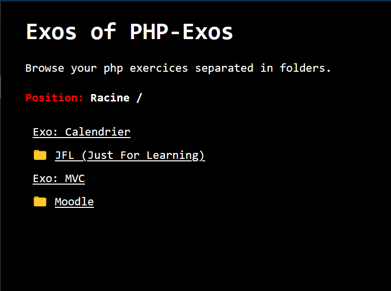

# Exos-explorer
### Un explorateur d'exerices en PHP.

Vous avez un repos contenant plusieurs exerices PHP ? Chaque dossier est une mini application pour comprendre un concept ? Pas besoin de redémarrer ou changer de dossier racine de votre serveur PHP à chaque fois que vous changez d'exercices... Et pas besoin de taper le chemin entier d'accès pour atteindre la racine de l'exercice.

#### Exemple de structure de repository:

    PHP-Exos
    │   .gitignore
    │
    ├───Calendrier
    │       calendar.html
    │       calendarBegin.PNG
    │       index.php
    │       style.css
    │
    ├───JFL
    │   ├───Exo-Liste-personnes
    │   │       index.php
    │   │
    │   ├───Gabarits
    │   │   │   classe.php
    │   │   │   classes.php
    │   │   │   gabarit.php
    │   │   │
    │   │   └───logo
    │   │           download.png
    │   │
    │   └───Puissance4
    │           bleu.jpg
    │           index.html
    │           index.php
    │           rouge.JPG
    │
    ├───Moodle
    │   ├───Exo1_Traduction_C-vers-PHP
    │   │       index.php
    │   │
    │   ├───Exo2_Dates
    │   │       index.php
    │   │
    │   └───Exo4_DemoArrays
    │           Exercice_Intro_Tableaux.pdf
    │           index.php
    │           Notes tableaux en PHP.txt
    │
    └───MVC
        │   data.txt
        │   gabarit.php
        │   index.php
        │   package-lock.json
        │
        ├───controller
        │       controller.php
        │
        ├───css
        │       styles.css
        │
        ├───images
        │       concerts.jpg
        │       error.png
        │
        ├───modele
        │       concerts.php
        │       movies.php
        │
        └───view
                concerts.php

**Importer [`index.php`](index.php) à la racine du repos et démarrer votre serveur à cet endroit-là.**

Parfois un dossier ne contient pas de fichiers PHP (c'est un dossier contenant d'autres exercices):  

Parfois un dossier ne contient pas d'index.php mais d'autres fichiers PHP qui doivent être accédés directement:  

Une fois un exercice ouvert:  

**AVERTISSEMENT**: le code n'est pas très propre (pas du tout). Plein de bugs n'ont pas été corrigés... mais ça fonctionne pour une utilisation basique. N'hésitez pas à modifier le code et personnaliser ce fichier à votre sauce (ça fait partie de l'apprentissage).